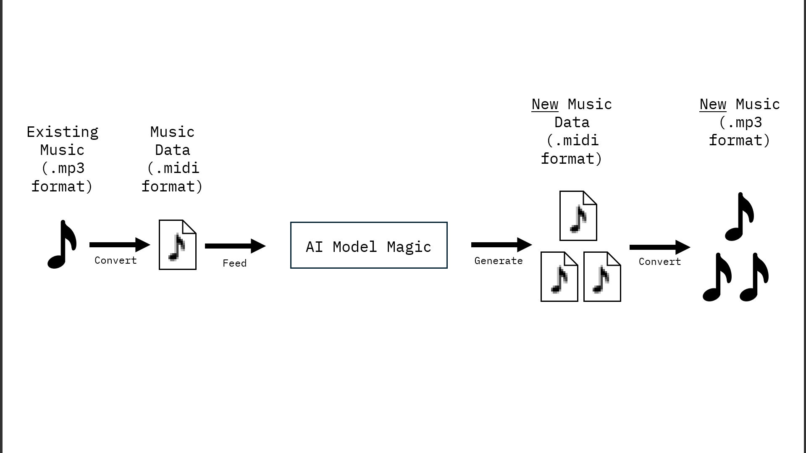
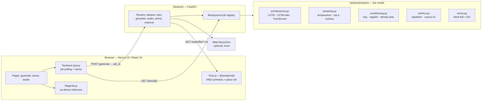

# MAiSTRO

**A neural network that composes classical piano — and the tooling to steer it, hear it, and prove it improved.**

MAiSTRO trains sequence models on MIDI transcriptions of Mozart, Beethoven and Chopin, then generates new piano music one note at a time. It ships as a full-stack application: a Python inference and training service, a browser client that synthesises the results without any audio plugins, and a blind listening test for deciding which model actually sounds better.

<p align="center">
  
</p>

```
Python 3.10 · TensorFlow/Keras 2.10 · music21 · FastAPI
TypeScript · Next.js 16 · React 19 · TanStack Query · Tone.js · Tailwind 4
```

---

## Contents

- [What it does](#what-it-does)
- [Why it's interesting](#why-its-interesting)
- [System architecture](#system-architecture)
- [The models](#the-models)
- [How generation is controlled](#how-generation-is-controlled)
- [How models are evaluated](#how-models-are-evaluated)
- [External AI models](#external-ai-models)
- [Tech stack, and why](#tech-stack-and-why)
- [Quick start](#quick-start)
- [Walkthrough](#walkthrough)
- [API reference](#api-reference)
- [Using it as a library](#using-it-as-a-library)
- [Repository layout](#repository-layout)
- [Engineering notes](#engineering-notes)
- [Limitations](#limitations)
- [Credits](#credits)

---

## What it does

1. **Prepare** — parses a folder of `.mid` files into a flat vocabulary of note, chord and rest tokens (194,441 tokens, 3,388 unique, from ~200 files).
2. **Train** — fits one of three architectures on those tokens, holding out a validation slice, checkpointing as it goes.
3. **Generate** — samples a new sequence, steered toward a key, tempo and mood, and writes it to MIDI with the exact settings and RNG seed that produced it.
4. **Listen** — plays the result in the browser, drawn as a piano roll, with no soundfont or native audio library required.
5. **Judge** — pits two architectures against each other in a blind A/B listening test and ranks them with Elo.
6. **Reach further** — routes prompts to Meta's MusicGen and Google's Magenta for music the piano vocabulary cannot express.

## Why it's interesting

Most "AI music" projects stop at step 2. The engineering worth talking about is in steps 3 through 6.

**The decoder was the bug, not the model.** The original implementation took `argmax` at every step. A deterministic decoder can only walk one path out of any given passage, so the model looped — and looked far less capable than it was. Replacing that with temperature sampling required *measuring* the model rather than copying defaults: its next-token distribution has a mean top probability of **0.95** and an entropy of **0.21 nats**, so the textbook `top_p = 0.9` truncates to a single token and silently reproduces greedy decoding. The usable temperature band is **1.4–2.0**, and that is what the UI slider spans.

**Control without retraining.** The network has no key or mood input, and labelled data to train one doesn't exist. Conditioning is applied as an additive bias over the vocabulary in log-probability space at the moment a note is chosen — the same mechanism as OpenAI's `logit_bias`. Asking for C major moves the in-key note fraction from 0.786 to 0.930, and tightens the spread across seeds from ±0.145 to ±0.039.

**Loss is not taste.** Validation loss says which model fits the corpus; it cannot say which one a person wants to hear. So two architectures compose an identical brief — same length, key, temperature, seed — and a listener picks the winner blind. Blinding is enforced server-side, not in the UI.

**Measured, not asserted.** Every number in this README and in [FEATURES.md](FEATURES.md) is an average over four random seeds. Where a single-seed result was flattering, it was thrown out.

## System architecture



Long-running work (dataset parsing, training, generation) returns a job id immediately and runs on a background thread. The client polls `GET /jobs/{id}` and streams the log. That makes job state *server state on a timer*, which is exactly what TanStack Query's `refetchInterval` is for — polling stops by itself when a job settles.

## The models

Three architectures share one dataset, one tokenizer and one decoder, so a difference in output is a difference in *architecture* rather than in plumbing.

| Model | Parameters | Input encoding | Notes |
|---|---:|---|---|
| `lstm` | 4.9M | scalar | Two stacked LSTMs. The textbook baseline. |
| `lstm_attention` | 178.8M | scalar | Bidirectional LSTM + self-attention. The original MAiSTRO network, and the default. |
| `transformer` | 3.9M | token embeddings | 4-layer causal decoder with learned token and position embeddings. |

The parameter counts tell a story. The original network ends in `Flatten() → Dense(3388)` over a 100×512 sequence — **175M parameters in the output layer alone**. The transformer reaches comparable capacity with 46× fewer by never materialising that matrix.

They also read their input differently, which the registry declares. The LSTMs receive one normalised float per step (`token_id / n_vocab`), which discards the vocabulary's structure — token 41 is not musically "between" 40 and 42. The transformer embeds each token id properly.

## How generation is controlled

| Control | What it does | Implementation |
|---|---|---|
| **Creativity** (temperature) | How far the decoder strays from its favourite note | Scales logits before sampling |
| **Top-k / nucleus** | Trims the tail so high temperature stays musical | Masks logits before sampling |
| **Key + scale** | Biases toward notes in the requested scale | Additive logit bias, proportional to how much of a chord falls outside |
| **Mood** | Presets over temperature, scale, register and density | 5 named presets |
| **Tempo** | Written into the MIDI as a metronome mark | `music21.tempo.MetronomeMark` |
| **Seed** | Reproduces a take exactly | Recorded in a `.json` sidecar beside every `.mid` |

Penalties are deliberately soft (a few nats). A heavier hand wins every argument with the model and flattens the music into scales.

## How models are evaluated

Two cheap, reproducible statistics run on every generation, and a human vote settles what they can't.

- **Repetition rate** — the share of 4-note windows the decoder has already played. Catches the looping failure mode.
- **Corpus KL** — KL divergence between the generated pitch-class histogram and the training set's. Catches distribution drift.
- **Blind A/B + Elo** — two models, one brief, one listener. K-factor 24, starting rating 1500. Votes persist with both takes' metrics.

Averaged over 4 seeds at 160 notes:

| Decoding | Repetition ↓ | Corpus KL ↓ | Unique tokens ↑ |
|---|---:|---:|---:|
| Greedy (the original) | 0.151 | 0.498 | 0.338 |
| `T=1.0, top_p=0.92` | 0.177 | 0.503 | 0.331 |
| `T=1.5` (default) | **0.064** | **0.301** | **0.444** |
| `T=1.9` | **0.024** | **0.147** | **0.570** |

Row two is the point: those are the sampling defaults you would copy from any text-generation tutorial, and they are statistically indistinguishable from greedy.

## External AI models

MAiSTRO composes *notes*. That is the right representation for classical piano and the wrong one for music that lives in timbre — no arrangement of piano notes means "dusty Rhodes through a tape delay." Two external models cover what the note vocabulary cannot, chosen to sit at opposite ends of the deployment spectrum.

| | **Meta MusicGen** | **Google Magenta (MelodyRNN)** |
|---|---|---|
| **What** | Text prompt → audio waveform | Melody continuation, note by note |
| **How it models music** | Transformer over an audio codec's latent tokens | RNN over symbolic notes — same task as MAiSTRO |
| **Where it runs** | Python backend, CPU or GPU | The visitor's browser, via TensorFlow.js |
| **Cost** | Free. Local weights, no API key, no per-request charge | Free. Public checkpoint, no server cost at all |
| **Trade-off** | ~2GB download; never yields an editable score | A few MB on first use; needs a network connection |
| **Install** | Optional: `pip install -r requirements-external.txt` | Bundled; dynamically imported |

Neither is an API service. MusicGen downloads its weights from Hugging Face on first run and executes locally; the endpoints return a `503` with install instructions until it's present. Magenta fetches its checkpoint from a public Google Cloud bucket and runs inference on the user's own GPU.

> **Is MusicGen comparable to MAiSTRO?** No, and it would be misleading to benchmark them. It generates audio, not notes, so none of the metrics above can be computed without a transcription step that would swamp the result. It's a *contrast piece* — it makes the choice of a symbolic model explicit. **Magenta's MelodyRNN is comparable**: same task, same output space, so the same metrics apply directly.

## Tech stack, and why

Every dependency earns its place by removing a specific problem.

| Tool | Role | Why this one |
|---|---|---|
| **TensorFlow / Keras 2.10** | Trains and runs all three architectures | Pinned to 2.10 because `keras_self_attention`, which the original model depends on, has no Keras 3 build |
| **music21** | MIDI ⇄ note vocabulary | Handles chords, rests and fractional durations that raw MIDI libraries leave to you |
| **NumPy** | Sampling, logit biasing, metrics | The decode loop is pure array math; no framework needed |
| **FastAPI + Uvicorn** | HTTP API over background jobs | Training blocks for minutes; a job id and a poll endpoint beat holding a request open |
| **Next.js 16 / React 19** | The client | Server components for prose, client components for anything touching audio |
| **TanStack Query** | Server state, cache, job polling | Job state is server state on a timer — `refetchInterval` stops itself when the job settles |
| **Tone.js + @tonejs/midi** | In-browser MIDI synthesis | Removed the Fluidsynth + soundfont install that stood between a fresh clone and hearing anything |
| **Tailwind CSS 4** | Styling | Design tokens in `oklch`, one committed dark theme |
| **Canvas 2D** | Piano roll | 300 notes repainted per animation frame would be 300 style recalcs as DOM; painted once offscreen and blitted instead |
| **pretty_midi / pydub / FluidSynth** | Optional WAV rendering | For the sampled-piano render, now an option rather than a requirement |

## Quick start

**Requirements:** Python **3.10** (TensorFlow 2.10 does not support 3.11+), Node 20+, and `ffmpeg` if you want WAV rendering.

```bash
# 1. Backend
python3 -m venv .venv && source .venv/bin/activate
pip install -r requirements.txt
uvicorn api.main:app --reload --port 8000     # → http://localhost:8000

# 2. Frontend (second terminal)
cd frontend && npm install && npm run dev      # → http://localhost:3000
```

Confirm the backend is up with `curl http://localhost:8000/health` → `{"status":"ok"}`. Interactive API docs are at `http://localhost:8000/docs`.

Optional extras:

```bash
brew install ffmpeg                              # WAV rendering
pip install -r requirements-external.txt         # MusicGen (~2GB of weights on first run)
```

**On checkpoints and data.** The parsed note vocabulary (`data/notes`, 194k tokens) *is* committed, so you can train a model immediately without sourcing any MIDI files. Trained weights are **not** in version control — the `lstm_attention` checkpoint is 1.4GB — so `/generate` will report that no weights were found until you either train one (`/train`, or `train_model()`) or drop a `.keras` file into `checkpoints/<arch>/`. The transformer trains fastest by a wide margin.

Full setup notes and troubleshooting live in [RUNNING.txt](RUNNING.txt).

## Walkthrough

The app is organised around what you're trying to do, not around the pipeline's internals.

**Compose**

| Page | What happens |
|---|---|
| `/generate` | Choose a model, move the creativity slider, pick a key, mood and tempo. Streams the job log, then plays the result on a piano roll with its metrics and reproducible seed. |
| `/library` | Every piece composed so far, each playing straight from MIDI in the browser, tagged with the settings that made it. |
| `/arena` | Two models, one brief, heard blind. Vote, see the reveal, watch the Elo leaderboard move. |
| `/studio` | MusicGen for text-prompted audio; Magenta for melody continuation that never touches the server. |

**Build a model**

| Page | What happens |
|---|---|
| `/dataset` | Drop in `.mid` files; they're parsed into the note vocabulary. |
| `/train` | Pick an architecture, set epochs and batch size, watch loss *and validation loss* per epoch. Checkpoints land in `checkpoints/<arch>/`. |

**Read about it** — `/story` is the original project write-up; `/how-it-works` is the engineering, with the measurements.

## API reference

| Method | Endpoint | Purpose |
|---|---|---|
| `GET` | `/health` | Liveness |
| `GET` | `/jobs/{job_id}` | Poll any background job: state, progress, streamed log, result |
| `POST` | `/dataset/upload` | Upload `.mid` files |
| `POST` | `/dataset/prepare` | Parse MIDI into the note vocabulary |
| `GET` | `/dataset/stats` | File count, whether notes are prepared |
| `POST` | `/train/start` | Train an architecture; reports `val_loss` per epoch |
| `GET` | `/train/history/{arch}` | Loss curves from the last run |
| `GET` | `/generate/options` | Architectures, moods, scales, calibrated slider bounds |
| `POST` | `/generate` | Generate with `arch`, `temperature`, `key`, `scale`, `mood`, `tempo_bpm`, `seed` |
| `POST` | `/audio/render` | Render a `.mid` to WAV via soundfont |
| `GET` | `/audio/file/{path}` | Serve `.mid` or `.wav`, traversal-guarded |
| `GET` | `/audio/library` | Every generated piece, with its config and metrics |
| `POST` | `/arena/pair` | Two blinded takes from two architectures |
| `POST` | `/arena/vote` | Vote, reveal, update Elo |
| `GET` | `/arena/leaderboard` | Ratings, W/L/D, recent votes |
| `POST` | `/arena/objective` | Score architectures on reproducible metrics — no listener needed |
| `GET` | `/external/musicgen/status` | Whether the optional audio stack is installed |
| `POST` | `/external/musicgen/generate` | Text prompt → audio |

## Using it as a library

The model is importable without the API.

```python
from backend.maistro.generate import GenerationConfig, generate

result = generate("nocturne.mid", GenerationConfig(
    arch="lstm_attention",
    n_notes=300,
    key="A", scale="minor",     # bias the decoder toward A minor
    mood="melancholic",         # sets temperature, register and density
    tempo_bpm=72,
))

print(result.midi_path)   # output/nocturne.mid  (+ nocturne.json sidecar)
print(result.metrics)     # {'repetition_rate': 0.0, 'pitch_class_kl': 0.495, ...}
print(result.config)      # includes the seed, so this take is reproducible
```

Training any architecture:

```python
from backend.maistro.train import train_model

result = train_model(arch="transformer", epochs=30, batch_size=64)
print(result.history["val_loss"])
```

The original pygame desktop interface still runs from the same environment:

```bash
python -m backend.legacy_gui.audio_to_spectrogram
```

## Repository layout

```
backend/maistro/         The model, framework-agnostic and API-agnostic
  architectures.py       Registry: lstm, lstm_attention, transformer
  dataset.py             MIDI → note/chord/rest vocabulary
  train.py               Training with a held-out validation split
  generate.py            GenerationConfig → MIDI + metrics + reproducible sidecar
  sampling.py            Temperature, top-k, nucleus — calibrated to this model
  conditioning.py        Key/register/density steering via logit bias
  theory.py              Scales, pitch classes, mood presets
  metrics.py             Repetition rate, corpus KL divergence
  arena.py               Blind A/B pairing and Elo
  weights_compat.py      Loads Keras 3 checkpoints into Keras 2 networks
  external/musicgen.py   Optional Meta MusicGen adapter
backend/legacy_gui/      The original pygame interface, still working
api/                     FastAPI routers over the above; background job registry
frontend/src/
  app/                   Routes: generate, library, arena, studio, train, dataset
  components/            NotePlayer (Tone.js), PianoRoll (canvas), SiteNav
  lib/                   Typed API client, TanStack Query hooks
checkpoints/<arch>/      Per-architecture weights, so models never overwrite each other
```

## Engineering notes

Three bugs surfaced while building the above. They're documented because finding them was most of the work.

**The trained checkpoint could not be loaded.** `weights-epoch035-0.2775.keras` was saved by Keras 3.8, but the project pins Keras 2.10. `load_weights()` fails on the Keras 3 zip archive, so the team's only trained model was unusable in the environment that was meant to run it. Rather than retrain, [`weights_compat.py`](backend/maistro/weights_compat.py) reads the weight arrays out of the archive and assigns them layer by layer — every assignment shape-checked, so a mis-mapping fails loudly instead of silently generating noise.

**Every generated note was a quarter note.** The MIDI writer built its stream with `Stream(list)`, whose `append()` recomputes offsets from each element's duration — and it never *set* a duration. The model's predicted rhythms were being discarded at the final step, after inference, before they reached the file.

**Training reported the wrong loss.** There was no validation split, so the number on screen was training loss, which keeps falling long after a model has begun memorising 200 MIDI files. The split is contiguous rather than random: the training windows overlap by one note, so a random split would leak nearly every validation window into training.

Also fixed: a path-traversal hole in `GET /audio/file/{path}` once filenames gained subdirectories, and three ways the arena leaked which architecture produced which clip (the payload, the streamed job log, and a metadata sidecar reachable by guessing a URL).

## Limitations

- **No trained transformer exists yet.** Its architecture, training path and arena integration are tested end to end, but nobody has run the epochs. The comparison above is a parameter count, not a quality claim — and the arena needs two trained models before it will start a listening test.
- **Conditioning is steering, not learned control.** A strong bias argues with the model instead of collaborating with it, which is why the penalties are small.
- **Elo needs volume.** Ratings mean little until a few dozen votes are in.
- **Magenta.js is unmaintained** (last release 2022) and pins an old TensorFlow.js; `npm audit` flags its dependency tree. It's dynamically imported so its failures stay contained to one component.
- **CPU training is impractical.** Use a GPU; the LSTM+attention network is 178.8M parameters.

## Credits

Built at **Western Cyber Society** by Henry Wang, Richard Augustine, Shawn Yuen, Elbert Chao, Ryan Huang, **David Lim**, Raymond Li, and Leo Karras.

Prior art that informed the original model:

- [Generating Original Classical Music with an LSTM Neural Network and Attention](https://medium.com/@alexissa122/generating-original-classical-music-with-an-lstm-neural-network-and-attention-abf03f9ddcb4)
- [Piano Music Generator](https://github.com/Skripkon/piano-music-generator)
- [Programming with MIDI in Python](https://youtu.be/zpZDwqsgSpc)
- [Simple Python Spectrograph with PyGame](https://swharden.com/blog/2010-06-19-simple-python-spectrograph-with-pygame/)

Full write-up of the post-launch work, with all measurements: **[FEATURES.md](FEATURES.md)**.

## License

MIT.
